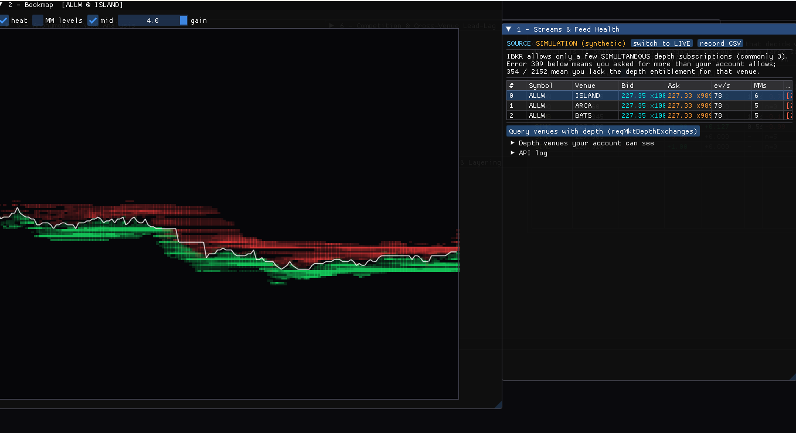
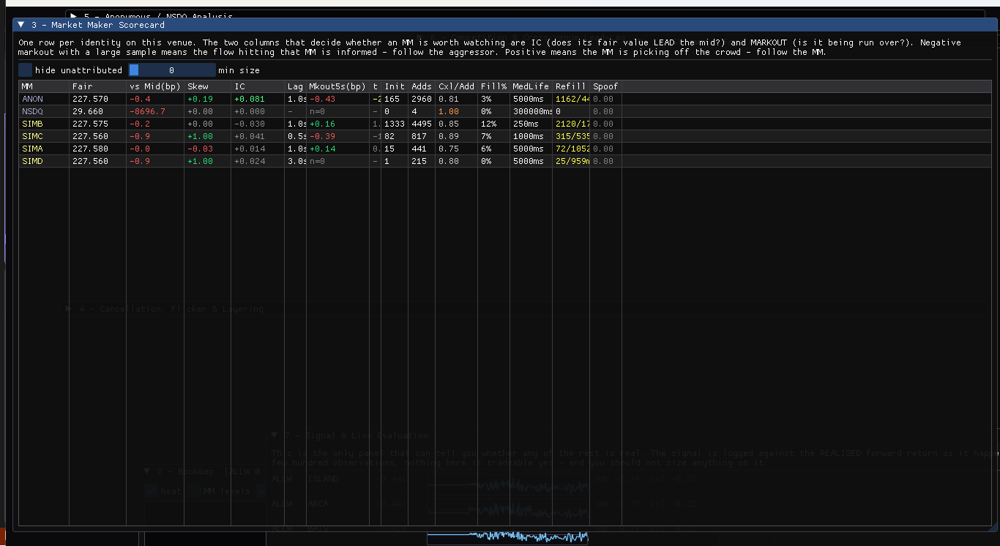
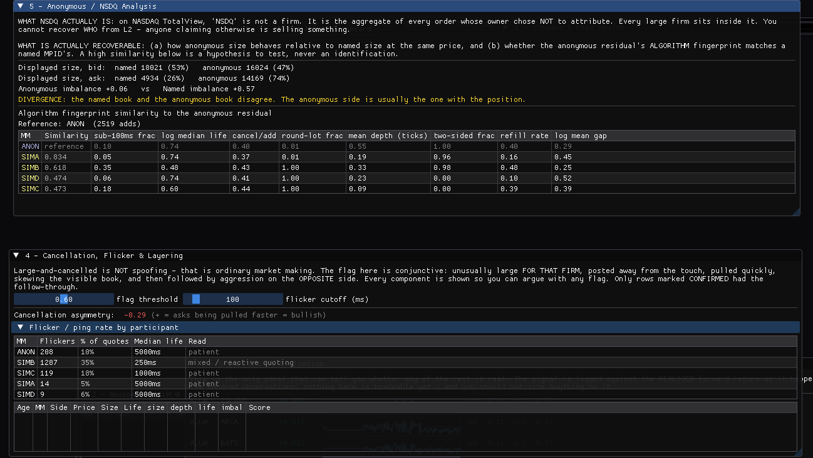
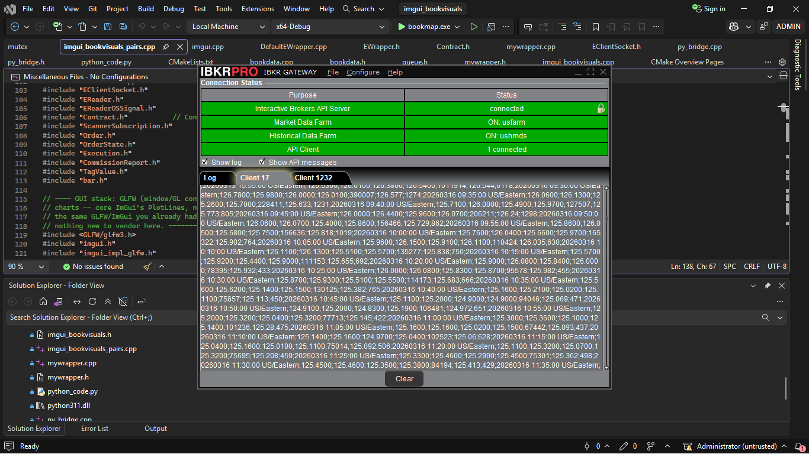

# orderbook-alpha

**A real-time market-microstructure research terminal, in C++20, on live IBKR Level-2 depth.**

It reconstructs the order book exactly as the exchange protocol defines it, attributes every
add / modify / cancel / fill to the market-maker identity that caused it, and then asks one
question of each participant: *does watching this firm tell you where price is about to go?*

The answer is not asserted. It is scored against realised forward returns, live, on screen, and
the program is perfectly willing to tell you that the signal is worthless.



---

## Contents

- [Why this exists](#why-this-exists)
- [The bug that defines the project](#the-bug-that-defines-the-project)
- [Architecture](#architecture)
- [What it measures](#what-it-measures)
- [Statistical honesty](#statistical-honesty)
- [Performance decisions](#performance-decisions)
- [Screenshots](#screenshots)
- [Building](#building)
- [File map](#file-map)
- [What's next](#whats-next)
- [Licence](#licence)

---

## Why this exists

Most order-book visualisers show you *size at price*. That is the aggregate. It throws away the
one field that a Level-2 feed gives you and a Level-1 feed does not: **who posted the order**.

On NASDAQ TotalView every displayed order carries an MPID , the four-letter code of the firm that
posted it. Firms behave differently, and those differences are measurable and persistent. A
patient two-sided market maker is not the same object as a sub-50ms flicker quoter, which is not
the same object as an iceberg refilling the same price level, which is not the same object as
size posted three ticks off the touch and pulled the instant the tape moves.

This program builds a behavioural profile per firm per venue, in real time, and then tests
whether any of those profiles lead the mid price. That test is the whole point. Everything else
is instrumentation.


## Architecture

Data flows exactly one way. There are no back-edges, which is what makes the whole pipeline
testable from a file.

```
   IBKR EReader callbacks          Synthetic feed (market closed)
              │                              │
              └──────────────┬───────────────┘
                             ▼
                          Ladder            protocol-correct book, per stream
                             ▼
                          Event             {ts, stream, mm, side, kind, px, sz, life, depth}
                             ├──────────►  Recorder        CSV to disk, for replay / offline research
                             ▼
                        Analytics           per-MM profiles · spoof scoring · markouts · lead-lag
                             ▼
                          Signal            composite, IC-weighted
                             ▼
                      Live evaluation       realised forward return, hit rate, t-stat
                             ▼
                            UI              Dear ImGui / GLFW / OpenGL
```


## What it measures

One profile per `(stream, MPID)`. Each number exists to answer a specific question.

| Measure | Question it answers | How |
|---|---|---|
| **IC** (information coefficient) | Does this firm's fair value *lead* the mid? | `corr(ΔfairMM[t], Δmid[t+lag])` at lags of 0.1 s, 0.5 s, 1 s, 3 s; the best lag is kept per firm |
| **Markout** (1 s / 5 s) | Is this firm being run over, or picking off the crowd? | Signed from the MM's side: bid fill → `mid_future − fill_px`. **Negative** mean = informed flow is hitting them → follow the aggressor. **Positive** = they're the informed one → follow the MM |
| **Quote lifetime** | Patient quoting or flicker? | Log-spaced histogram (1 ms → 300 s), median and sub-100 ms fraction |
| **Cancel/add ratio, fill ratio** | Real liquidity or display? | `cancels/adds`, and `sizeFilled / (sizeFilled + sizeCancelled)` |
| **Initiative vs joining** | Is the firm revealing a view or following one? | Counts price levels it *established* vs merely *joined*, then resolves the mid move 2 s later |
| **Refill latency** | Iceberg behaviour | Time between a price level dying and the same firm re-posting there |
| **Spoof / layering score** | Manufactured book pressure | Five explicit components, described below |
| **Fingerprint similarity** | Does the anonymous residual behave like a named algo? | 8-dimensional behavioural vector, Euclidean distance |

### The spoof score is conjunctive, and decomposed

Large-and-cancelled is **not** spoofing. That is ordinary market making. The score only fires on
the *combination*, and every component is stored separately so any flag can be argued with:

```cpp
sp.cSize  = size outlier vs THAT FIRM's own average add size
sp.cDepth = how far off the touch it sat    (a genuine quote wants the queue)
sp.cLife  = how fast it was pulled
sp.cImbal = did it actually skew the visible book while it was there
sp.cFollow= did that firm then AGGRESS THE OTHER SIDE   ← resolved later

sp.score = 0.30*cSize + 0.25*cDepth + 0.25*cLife + 0.20*cImbal;
```

Only rows where `cFollow` later confirmed are marked **CONFIRMED**. Flagged size is then
subtracted from the touch imbalance, so a book whose imbalance was manufactured is not read as
real pressure.


## Statistical honesty

This is the section I would want a reviewer to read, because it is where most dashboards quietly
lie.

**Any dashboard can render a confident-looking number.** The Signal panel therefore logs every
signal observation alongside the realised forward return and accumulates the hit rate and t-stat
in real time. If the t-stat does not clear ~2, nothing else on the screen is tradeable, and the
panel says so rather than hiding it.

**Sampling is non-overlapping on purpose.** Logging a fresh observation every 100 ms against a
5-second forward return would produce heavily autocorrelated samples whose t-stat is inflated by
roughly `sqrt(overlap)` — that construction will show a t of 6 on pure noise. So the 5 s horizon
is sampled once per 5 s and the 30 s horizon once per 30 s, each in its own queue. Far fewer
observations, but the number means what it says.

**Weights are exposed, not tuned in secret.** The five signal components (`wFair`, `wImbal`,
`wCxl`, `wMarkout`, `wLead`) are live sliders sitting directly above the evaluation panel, so the
only honest way to use the program is to watch the out-of-sample scoreboard while you change
them.

**The fair-value term is IC-weighted.** Firms are weighted by their *own measured* information
coefficient, so participants that have historically led the mid dominate the consensus and the
rest contribute almost nothing — rather than every MPID getting an equal vote for no reason.

**Cross-venue lead-lag is the cleanest structural edge in here**, and the only one that doesn't
depend on a behavioural assumption: the same asset cannot be in two places at once, so if
venue A's mid reliably leads venue B's at some lag, venue B has to catch up. The program
subscribes to the same symbol on ISLAND / ARCA / BATS and measures the lagged cross-correlation
directly.

---

## Screenshots

> **These were captured in the built-in synthetic mode** (`SOURCE: SIMULATION`), so the
> participants are the four synthetic personalities `SIMA`–`SIMD` rather than real MPIDs. The
> live IBKR path is shown working in the fourth image. Simulation exists precisely so the
> detectors can be validated when the tape is shut: `SIMD` is constructed to be a spoofer, and if
> the manipulation panel does not light up for `SIMD`, the detector is broken.

**Bookmap heatmap + feed health.** Time × price raster, bid depth green, ask depth red, mid
overlaid. The Streams panel surfaces IBKR depth errors verbatim — `309` (more simultaneous depth
lines than the account allows) and `354` (missing depth entitlement) are reported rather than
swallowed, because a depth feed returning nothing looks exactly like a quiet market.


**Market-maker scorecard.** One row per identity per venue. The two columns that decide whether a
participant is worth watching are IC and markout.



**Anonymous analysis + layering detection.** Top: named-vs-anonymous size split, the divergence
flag when the named and anonymous books disagree, and the 8-dimensional fingerprint table.
Bottom: per-participant flicker rates and the decomposed layering flags.



**Live IBKR Gateway session.** Market data and historical data farms connected, API client
attached — the live path this was developed against.



---

## Building

Windows / MSVC / CMake. Verified against Visual Studio 2026 (MSVC 19.51), CMake 4.4, x64 Release.

### 1. Get the IBKR TWS API

It is licensed by Interactive Brokers and **cannot be redistributed**, so it is not in this
repository. Download the C++ API from <https://interactivebrokers.github.io/> and unpack it so
that `TWS/cpp/client/EClientSocket.cpp` exists — or point CMake at wherever you put it:

```bash
cmake -S . -B build -A x64 -DTWS_API_DIR="C:/path/to/IBJts/source/cppclient/client"
```

### 2. Configure and build

GLFW 3.4 and Dear ImGui are fetched automatically by CMake. Nothing else is needed.

```bash
cmake -S . -B build -A x64
cmake --build build --config Release
```

### 3. Run

```bash
./build/Release/mm_alpha.exe
```

With **IB Gateway or TWS running and the API enabled on port 4001**, it connects, subscribes to
depth on ISLAND / ARCA / BATS and to the trade tape, and goes live. With nothing to connect to,
it falls straight through to the synthetic feed so the analytics and UI are still exercisable —
no configuration required, no silent failure.

> **Note on IBKR depth entitlements.** A retail account gets only a small number of
> *simultaneous* market-depth lines (commonly 3), and real MPIDs require NASDAQ TotalView. The
> default configuration is three streams precisely because that fits inside the usual limit.
> Asking for more returns error `309`, which is displayed rather than swallowed.

---

## File map

| File | Lines | What's in it |
|---|---:|---|
| `mm_alpha.cpp` | 2,585 | Everything: ladder state machine, event normalisation, recorder, per-MM analytics, spoof scoring, markouts, lead-lag, signal, live evaluation, synthetic feed, seven UI panels |
| `ib_wrapper.h/.cpp` | 181 | The boring half of IBKR's `EWrapper` — connection handshake, error triage, contract validation. Depth callbacks are no-ops here on purpose; `AlphaWrapper` in `mm_alpha.cpp` overrides them |
| `CMakeLists.txt` | — | Dependency handling: GLFW + ImGui fetched, TWS API user-supplied with a clear failure message |

`mm_alpha.cpp` is one large file, and that is a considered trade-off rather than laziness: the
analytics are a single data-flow pipeline with no reusable seams, and splitting it across headers
would have produced translation-unit boundaries that exist only to satisfy a convention. It is
organised into twenty numbered sections, each with a header comment explaining *why* the code
below it is the way it is — section 0 is utilities, section 19 is `main`.

---

## What's next

**Offline replay and walk-forward evaluation.** The recorder already writes every normalised
event to CSV, and analytics already consume nothing but `Event` — so the replay path is a reader,
not a rewrite. That closes the loop from "the live t-stat looks promising" to "it held up across
a month of captured tape".

**A statistical-arbitrage engine on the same IBKR stack.** Separately in progress: runtime
universe construction via IBKR's market scanner, dual-class pair detection from issuer names
(rather than a hardcoded ticker list), Augmented Dickey-Fuller cointegration testing with a
multiple-testing correction, Ornstein-Uhlenbeck fits for half-life and z-score, GARCH(1,1) as a
volatility filter, and quarter-Kelly sizing floored by CPPI with a drawdown circuit breaker.
It shares this repository's discipline about what a backtest is allowed to claim.

**Costs, honestly.** The measurements here are about information, not execution. Before any of
this is tradeable it has to clear the spread plus fees plus slippage, and that comparison belongs
in the evaluation panel alongside the raw t-stat.

---

## Licence

MIT — see [LICENSE](LICENSE).

Third-party components are **not** included and retain their own licences: the IBKR TWS API
(Interactive Brokers), GLFW (zlib/libpng) and Dear ImGui (MIT) are fetched or supplied at build
time.

This is research and visualisation software. It reads market data and computes statistics; it
does not place orders. Nothing here is investment advice.
